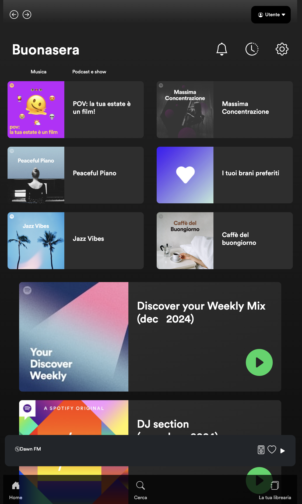
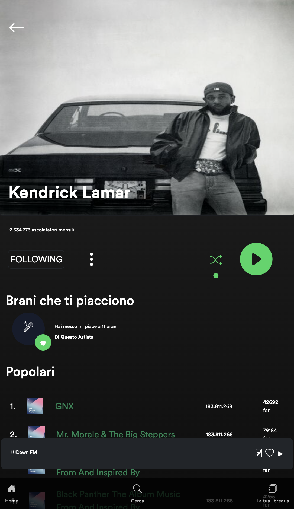
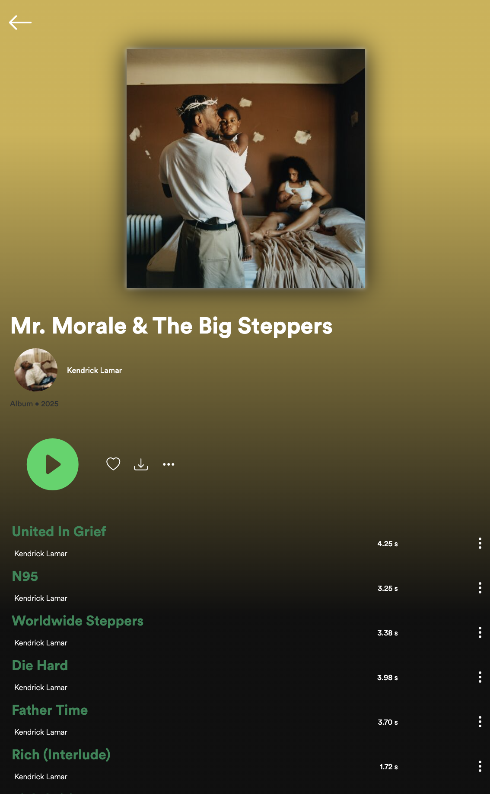
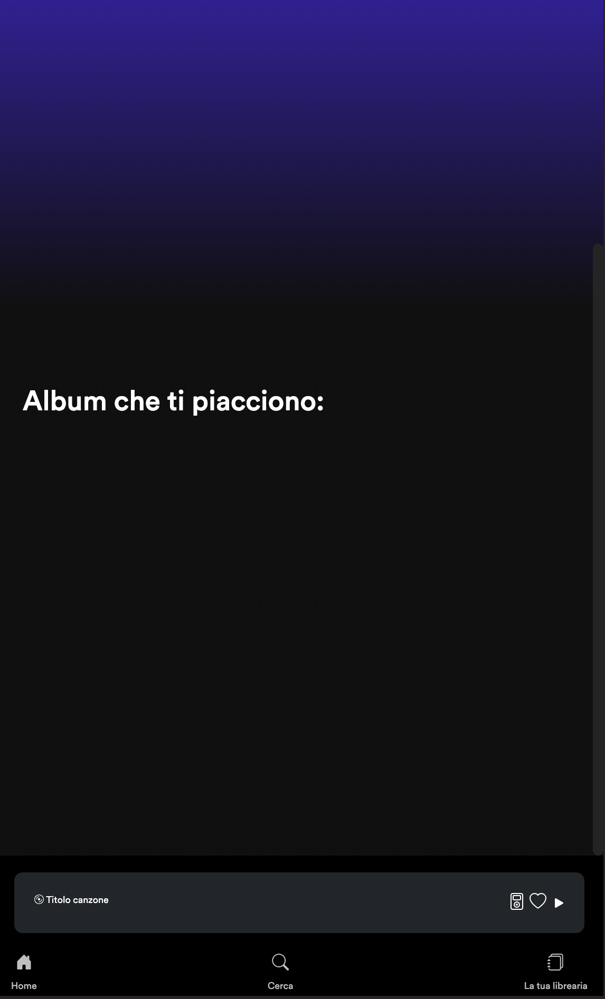

# Spotify Build Week - Replica di una Piattaforma di Streaming Musicale

## Descrizione del Progetto

Il progetto "Spotify Build Week" è una versione semplificata della celebre piattaforma di streaming musicale Spotify, sviluppata come applicazione web interattiva. Grazie a questa app, gli utenti possono esplorare album, artisti e tracce musicali, utilizzando i dati in tempo reale forniti dall'API Striveschool Deezer. L'interfaccia utente, dal design moderno e minimalista, è ottimizzata per offrire un'esperienza di navigazione fluida e piacevole sia su desktop che su dispositivi mobili, con un tema scuro che migliora la visibilità durante l'ascolto.

L'applicazione è stata progettata per garantire una navigazione intuitiva, rendendo facile la scoperta di album, brani e artisti. Gli utenti hanno accesso a un ampio catalogo musicale e possono interagire con un player che permette l'ascolto di tracce e anteprime.

### Caratteristiche principali

- Esplorazione di album e artisti: Gli utenti possono scoprire e visualizzare album e tracce di vari artisti, con la possibilità di accedere a informazioni dettagliate su ogni contenuto.

- Player musicale interattivo: Il lettore musicale consente la riproduzione delle tracce, con comandi intuitivi per play, pausa e avanzamento.

- Design responsivo: L'interfaccia si adatta automaticamente a dispositivi desktop e mobili, assicurando un'esperienza utente ottimale in ogni contesto.

- Interazione dinamica: Grazie all'integrazione con l'API Deezer, l'app permette una navigazione fluida e interattiva, con aggiornamenti in tempo reale per esplorare facilmente i contenuti musicali.

## Struttura del Progetto

### Linguaggi e Tecnologie Utilizzati:

- HTML5: Utilizzato per la struttura e il markup semantico delle pagine web, garantendo una base solida e ben organizzata per il contenuto.

- CSS3: Impiegato per la personalizzazione visiva e lo styling dell'applicazione, creando un design moderno con dettagli estetici, transizioni e animazioni fluide.

- Bootstrap: Framework front-end che facilita la creazione di layout responsivi, ottimizzando automaticamente la visualizzazione su dispositivi di diverse dimensioni (desktop, tablet, smartphone) per un'esperienza utente uniforme.

- JavaScript (ES6): Utilizzato per gestire le funzionalità dinamiche e interattive dell'applicazione, come i controlli di riproduzione musicale e le chiamate API, migliorando l'interazione con l'utente.

- API Striveschool Deezer: Permette di recuperare dati musicali in tempo reale, come album, tracce e artisti, per arricchire l'esperienza di navigazione.

- Font "Circular": Tipografia moderna e leggibile, scelta per garantire una lettura chiara e un'estetica elegante nell'interfaccia utente.

## Preview della pagina:
### Desktop

  
  

  

  

  

### Mobile 

## Guida all'Uso
## Installazione:

### 1. Clona il repository

- Copia il codice:

git clone https://github.com/Inchino

### 2. Esegui il progetto:
- vai alla cartella del progettoclonata:

cd music-app

- Apri il file index.html nel tuo browser per visualizzare l'applicazione in azione.

### Navigazione dell'app:

- Homepage: La homepage offre un punto di partenza per scoprire nuovi contenuti musicali. Qui gli utenti possono esplorare facilmente una selezione di artisti, album e brani recenti, con un'interfaccia intuitiva che facilita la navigazione tra le diverse categorie musicali. È l'area ideale per scoprire le ultime novità o per essere ispirati dalle tendenze del momento.

- Ricerca: La barra di ricerca consente agli utenti di trovare rapidamente brani, album o artisti specifici. Grazie alla sua funzione di autocompletamento, è possibile visualizzare suggerimenti mentre si digita, rendendo la ricerca ancora più efficiente. Questa funzionalità consente di navigare facilmente nell'ampio catalogo musicale e di accedere direttamente ai contenuti desiderati.

- Dettagli Album/Artista: Cliccando su un album o su un artista, l'utente accede a una pagina dedicata con informazioni dettagliate. Per ogni album, sono visibili le tracce contenute, le date di rilascio, la durata totale e altre curiosità. Nella pagina dell'artista, si possono trovare biografie, discografie complete e altre informazioni pertinenti. Questa sezione offre una panoramica approfondita e arricchisce l’esperienza di ascolto con contenuti aggiuntivi.

- Playlist Preferiti: Gli utenti hanno la possibilità di creare e salvare playlist personalizzate con i loro brani preferiti. Questo permette di raccogliere le tracce più amate in un’unica lista, per un ascolto rapido e senza interruzioni. Le playlist possono essere facilmente gestite, rinominate e modificate in qualsiasi momento, offrendo un’esperienza musicale su misura per ogni gusto e stato d’animo.

### Requisiti di sistema:

- Browser moderno: L'applicazione è compatibile con i principali browser moderni, come Chrome, Firefox e Edge, garantendo una visualizzazione ottimale e prestazioni fluide su tutte le piattaforme.

- Connessione internet stabile: Per una fruizione ottimale dei contenuti, è necessario disporre di una connessione internet stabile. Questo assicura il corretto caricamento dei dati musicali in tempo reale tramite l'API, evitando interruzioni durante la navigazione e l'ascolto delle tracce.

### Struttura dei File:

- index.html: La homepage dell'applicazione, che funge da punto di accesso principale. Mostra l'interfaccia utente con una panoramica di album, artisti e brani recenti, permettendo agli utenti di iniziare subito a esplorare il catalogo musicale.

- album.html: Pagina dedicata ai dettagli degli album selezionati. Viene visualizzato un elenco completo delle tracce contenute nell'album, con informazioni aggiuntive come data di rilascio, durata e altre curiosità, per una navigazione approfondita.

- artist.html: Pagina dedicata agli artisti, dove vengono presentati i dettagli su ogni artista, incluse biografie, discografia completa e link agli album. Inoltre, è possibile esplorare l'intero repertorio musicale dell'artista, con un elenco dei loro album più significativi.

- playlist.html: Pagina per la gestione delle playlist personalizzate. Gli utenti possono visualizzare le tracce salvate, ascoltarle e interagire con i brani, come aggiungere, rimuovere o riorganizzare le tracce nelle playlist. Ogni brano può essere riprodotto direttamente, permettendo un'esperienza di ascolto personalizzata.

- style.css: Foglio di stile che contiene gli stili personalizzati per l'interfaccia dell'applicazione. Gestisce il design visivo, inclusi layout, colori, tipografia e altri dettagli estetici, assicurando una presentazione coerente e un'esperienza utente piacevole.

- script.js: Contiene la logica per la gestione delle funzionalità dinamiche dell'app, inclusi i controlli di riproduzione musicale (play, pausa, avanzamento) e l'interazione con l'utente. Si occupa anche delle chiamate API per recuperare i dati musicali in tempo reale.

- album.js: Gestisce le funzionalità specifiche relative alla visualizzazione e interazione con le informazioni sugli album. Include la gestione dei dati delle tracce, l'integrazione con l'API per recuperare informazioni sugli album e la loro visualizzazione.

- artist.js: Gestisce la logica per la visualizzazione delle informazioni sugli artisti. Si occupa del recupero dei dati relativi agli artisti tramite l'API, della visualizzazione dei dettagli e dell'elenco degli album associati a ciascun artista.

- playlist.js: Gestisce le playlist personalizzate, permettendo agli utenti di creare, modificare e interagire con le proprie playlist. Include la logica per aggiungere e rimuovere brani, ordinare le tracce e aggiornare in tempo reale la playlist salvata.

## Ringraziamenti Un sentito ringraziamento va a tutte le persone che hanno contribuito in modo significativo al successo

Un sincero e profondo ringraziamento va a tutte le persone che hanno contribuito con passione e dedizione al successo di questo progetto. In particolare a Valentina Rizzo, Alessandro Incalza, Samuele Converso, Ombretta Deriu e Mariam Azfar Azami. La loro preziosa collaborazione, il loro impegno costante e la loro competenza hanno rappresentato il cuore pulsante di questo lavoro, rendendo possibile la realizzazione di questa applicazione. Senza di loro, questo progetto non sarebbe stato lo stesso.

### Licenza 
Questo progetto è sviluppato a scopo educativo e non è destinato a fini commerciali.